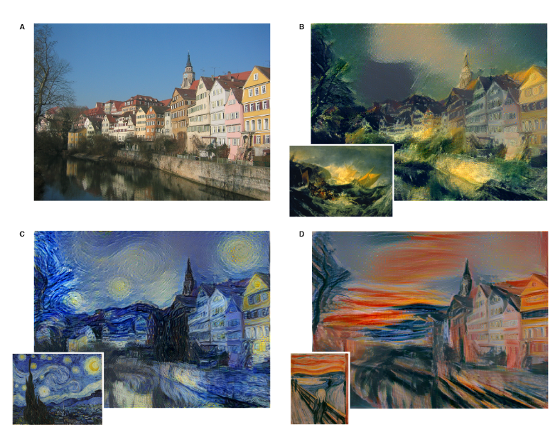

# neural-style-transfer

 ***this is currently work in progress, it does not work yet***

 This is an implementation of this paper: https://arxiv.org/pdf/1508.06576.pdf

 It is a method of applying stylistic features learned from one image (the style image) and applying them to "repaint" a content image in that style. Some examples (these images taken from the linked paper above):

 

## Setup

- The pretrained model is too large to store in this repo (> 500MB), so you need to download it here and place in the repo root directory: [http://www.vlfeat.org/matconvnet/models/imagenet-vgg-verydeep-19.mat](http://www.vlfeat.org/matconvnet/models/imagenet-vgg-verydeep-19.mat)

- If you run in IPython on the Anaconda distribution, there is nothing more to setup. Otherwise, the following packages should be installed: scipy, numpy, imageio, matplotlib, keras
