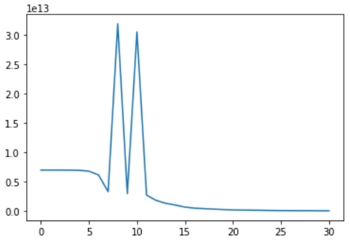

# neural-style-transfer

This is an implementation of this paper: https://arxiv.org/pdf/1508.06576.pdf

It is a method of applying stylistic features learned from one image (the style image) and applying them to "repaint" a content image in that style. Some examples (these images taken from the linked paper above):

 

## Setup

- The pretrained model is too large to store in this repo (> 500MB), so you need to download it here and place in the repo root directory: [http://www.vlfeat.org/matconvnet/models/imagenet-vgg-verydeep-19.mat](http://www.vlfeat.org/matconvnet/models/imagenet-vgg-verydeep-19.mat)

- If you're running the Anaconda distribution, you only need to install Keras: `conda install keras` Otherwise, the following packages should be installed: scipy, numpy, imageio, matplotlib, keras

## Optimizer weirdness

Out of nothing more than curiosity, I decided to plot the cost function over iterations and noticed this oddity:

The 10x spike in loss around iterations 8 and 10 baffles me. It seems to occur pretty consistently regardless of differing initial state. Perhaps someone who reads this and knows the intricacies of L-BFGS might be able to enlighten me? It doesn't impact the end result, but it is weird.